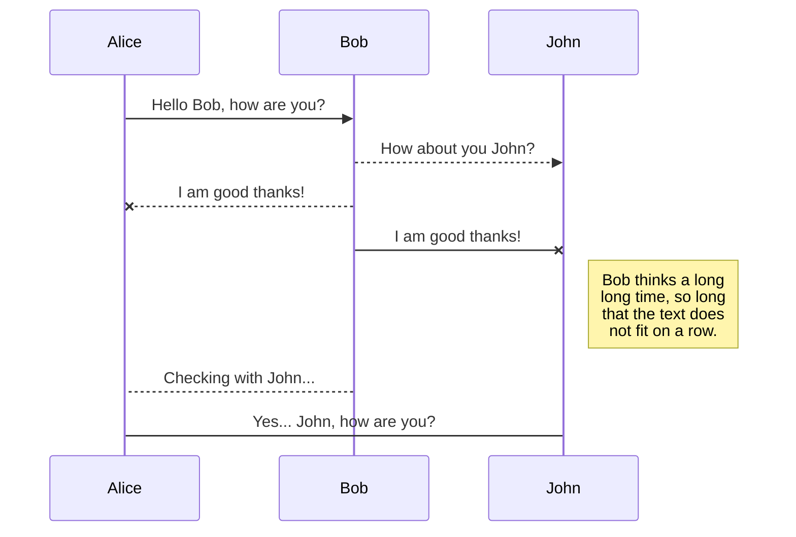

## Overview

Et adipisci omnis vel tempore pariatur et similique provident vel temporibus optio. Nam eius galisum et fuga enim eos rerum voluptates est omnis nihil sed pariatur dolorem.

Eum adipisci nesciunt et consequatur dolorum ut velit magni ex vero voluptatem est saepe fugiat qui dolores veritatis vel aliquam consectetur? Aut molestias officiis ab nihil odio et accusantium earum. Qui sint dolorum et minima repudiandae non repellat delectus qui sequi quia ea quaerat galisum eos minus animi et nobis sint. Eos nulla rerum id inventore galisum eum molestiae magni.

Est maiores animi in dolor voluptatibus ab ipsam odio qui dolorum alias. Non consequatur velit in blanditiis voluptas rem ipsum ipsum. Qui veniam assumenda eos minima illo ea voluptatum ratione eos ratione aliquid in obcaecati quos est autem iusto. Ut asperiores dolorum in aspernatur illo et autem galisum vel accusantium aliquid vel molestiae harum in asperiores tempore et laborum laborum.

Et porro illum ab voluptas modi et sapiente error id reprehenderit itaque ut fuga rerum ut aliquam perferendis. Aut maxime internos a adipisci doloribus est ipsam vero! Quo obcaecati veritatis id repudiandae suscipit ab corporis reiciendis sed magnam nemo cum consequuntur repellat!

At maxime similique quo nobis deleniti vel dolor dolor qui voluptatem doloremque sit provident velit. Aut consequatur asperiores et facere itaque cum saepe aperiam ut quod quia ut porro galisum sit ducimus voluptas. Sit ullam nihil eum itaque beatae cum minima iure et dolorem voluptas ut corporis impedit sit ipsam quas id tempora incidunt. Aut ducimus praesentium et iste voluptatibus ut amet nobis qui maxime fugit At dolor blanditiis qui accusamus aperiam ea dignissimos accusamus.

Ea libero dolor ea autem reprehenderit est aliquid consequatur non voluptatem sequi ea libero repellendus ut repellat recusandae? Aut voluptas necessitatibus et itaque galisum ut ipsa ipsam.

### History

Et harum vero ut ducimus autem et iusto quia est dignissimos maiores ut dolore porro rem illo molestias eos veniam assumenda. Hic doloribus aspernatur qui explicabo architecto sed adipisci nobis sit ipsum eligendi et aspernatur tenetur est vero reiciendis vel voluptatem vitae.

Cum debitis quia cum mollitia nemo aut sunt internos ut autem rerum est enim rerum non omnis alias. Hic magnam aperiam eos laudantium dolores At nihil modi. Qui corporis commodi sed assumenda eveniet aut excepturi rerum sed dolorem facere ut adipisci laboriosam quo facere corporis. In maiores soluta ut tempora consequuntur aut minus odio.

Aut doloremque illo aut debitis debitis est eveniet velit eos voluptas earum qui adipisci autem ut laudantium nihil et aperiam pariatur. Eos reiciendis minus qui expedita sequi aut asperiores cumque sed rerum galisum a voluptas vitae a voluptatem veritatis.

Ex dolores deserunt aut molestias maiores id magnam corporis eos eveniet nihil ut necessitatibus magnam et soluta deleniti At mollitia veniam. Et aliquam soluta 33 natus minima ut dolor perspiciatis! Non autem ipsa et necessitatibus suscipit ea tempora sunt et mollitia repellendus aut aliquam repellat.

### Audience

Et amet repellat et molestias omnis aut distinctio sint qui unde tempora ut velit architecto et sequi dolorem non atque earum? Sit quae ducimus sed quaerat ipsam in architecto tempore et sint reiciendis et dolor enim et adipisci dolores aut consectetur tenetur.

[[Figure]{.figure-number-before} - Basic interaction]{.figure-caption}

Sit itaque enim qui voluptas laborum rem placeat quae non omnis eligendi ut corrupti doloribus. Id aperiam tempore nam quas aperiam qui repudiandae incidunt At rerum praesentium. Aut eaque tempore aut nisi enim et praesentium obcaecati in voluptatibus ratione!

