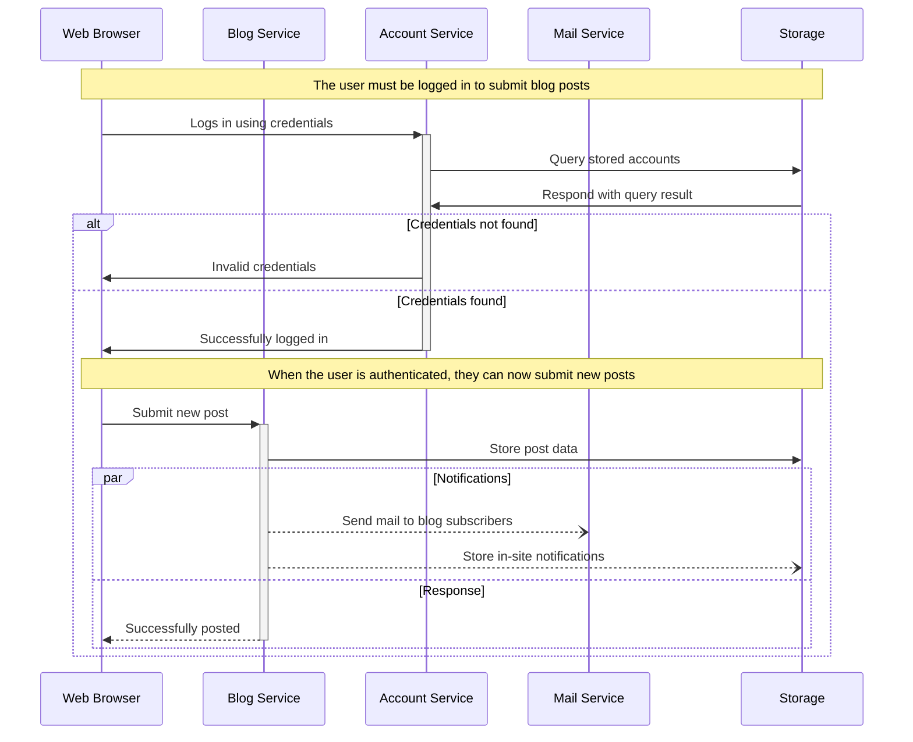

## Specification {.tabbed}

This section is tabbed for your reading pleasure.

### Inputs {.tabbed .unnumbered .unlisted}

Eum tenetur minus in voluptatem quia aut vitae incidunt et illum quia. Vel temporibus doloremque in quasi dolorum aut debitis galisum. Ut placeat voluptatem et vero explicabo est mollitia repudiandae. Quo blanditiis recusandae et Quis corporis non esse quae.

#### A String {.unnumbered .unlisted}

Eos natus nulla ad voluptatum nobis sed quos expedita ut galisum perferendis nam eaque dolores. Sit sunt laborum et aliquam atque sit natus enim est reprehenderit voluptatem aut illum sunt aut cumque temporibus in temporibus deleniti.

Aut voluptas enim ex nihil quisquam et odit quam. In expedita quasi sit modi tempora id aspernatur enim in molestiae delectus vel sunt suscipit et corporis ullam sed magni amet.

#### A Number {.unnumbered .unlisted}

Aut laborum deleniti et asperiores magni ut veniam vitae. Sed enim distinctio est similique assumenda in voluptas velit sed illum eligendi qui maiores autem! Et galisum rerum qui enim officiis et voluptate voluptatem sed necessitatibus quia et cupiditate explicabo non numquam quia.

Ut voluptatibus illo sit porro quae ab accusamus corporis et omnis vero At consequatur sapiente ea quasi tempore eum dolor saepe! Vel delectus accusamus id internos debitis non neque doloremque. Sit aliquam fugiat rem esse beatae sed iste quidem est accusamus officiis sed amet officiis ut ratione veniam.

#### Undefined {.unnumbered .unlisted}

Id praesentium voluptatum et earum dolor sit numquam autem. Ea similique repudiandae et minus adipisci sit dolorum quas eum vero galisum et dolor beatae aut consectetur facere. Et necessitatibus omnis qui soluta ipsa et adipisci officia.

Et accusamus architecto et repudiandae veritatis qui quos autem sit doloribus praesentium aut rerum delectus. Quo magni facilis quo fuga accusamus ut minus reprehenderit. Non tenetur fugiat et natus illum 33 fugit odio id incidunt amet.

### Logic {.unnumbered .unlisted}

Qui quasi architecto in iste recusandae non suscipit molestiae qui laudantium fugiat. Qui architecto facilis est praesentium architecto cum itaque velit et galisum sequi ex quas minima. Non esse quam et eveniet optio est expedita deserunt.

A harum officiis ut quaerat labore sed voluptatem facilis ut doloremque delectus est enim incidunt. A laborum omnis et tempore nobis ab nesciunt laboriosam a omnis ullam quo cupiditate necessitatibus ab odit consectetur.

Ut atque assumenda est laboriosam modi qui internos voluptatum vel dignissimos magnam ut nemo dolorum non quod fugit At possimus quibusdam. Vel autem voluptas et illo autem aut repellendus veritatis. Ut omnis sunt qui iste assumenda sit modi dolorem. Eos aspernatur necessitatibus qui deserunt provident aut earum possimus ut quam sunt aut minima quia sed libero sunt?

[[Figure]{.figure-number-before} - A Mermaid figure]{.figure-caption}



Et accusamus quaerat At quia ipsum At unde velit sed rerum nemo. Est blanditiis nobis ut repudiandae autem ut inventore magnam quo saepe vitae.

Est consequatur eius sed quam dignissimos non accusantium unde. Qui nihil optio ut corporis omnis ut nulla nihil ea necessitatibus recusandae qui dolores minima. Non voluptatum esse aut sint galisum quo illo perferendis in eveniet veritatis cum nisi sapiente sit aliquid numquam aut nemo nostrum. Et ducimus reiciendis et quaerat repellendus At consequatur rerum non fugiat ducimus non necessitatibus officiis et possimus accusamus.

Et explicabo esse et quas culpa a pariatur ullam. Et magnam recusandae vel quod nobis est obcaecati voluptas in dolore officia. Quo possimus consequatur non molestiae quia quo praesentium voluptas est officia debitis.

[[Example]{.example-number-after} - A TypeScript example]{.example-caption}

```typescript {#a-typescript-example}
/**
 * Copy files matching glob patterns to a directory.
 *
 * @param patterns
 * Glob patterns.
 *
 * @param toDirectory
 * Directory to which to copy files.
 */
export function copyFiles(patterns: string[], toDirectory: string): void {
    // Source files are expected to be relative to current directory.
    for (const sourceFile of globIterateSync(patterns)) {
        const destinationFile = path.resolve(toDirectory, path.isAbsolute(sourceFile) ? path.basename(sourceFile) : sourceFile);

        if (destinationFile === path.resolve(sourceFile)) {
            throw new Error(`File ${sourceFile} cannot be copied to itself.`);
        }

        const destinationDirectory = path.dirname(destinationFile);

        // Create destination directory if it doesn't exist.
        if (!fs.existsSync(destinationDirectory)) {
            fs.mkdirSync(destinationDirectory, {
                recursive: true
            });
        }

        fs.copyFileSync(sourceFile, destinationFile);
    }
}
```

Nam deserunt veritatis ab quas doloribus et incidunt quas nam mollitia labore eos autem iste aut voluptatem sunt. Quo necessitatibus maxime sit provident modi in voluptas quasi aut internos dignissimos. Qui molestiae nulla aut amet quos et tempore odio. Eum vero ullam id sequi dolorem 33 illum sint et velit obcaecati qui consequatur iste ea harum perferendis 33 dolorem laborum.

Qui atque maxime ex error deserunt a sint reprehenderit. 33 deserunt repellat aut quisquam nisi ad autem quos. Ut doloribus incidunt in voluptates sequi quo modi dolor.

Sit autem eius ex atque voluptate in rerum sint est saepe distinctio et galisum unde. Et iure mollitia et officia minima et velit omnis sit porro harum. Et dignissimos ipsa non praesentium recusandae qui galisum voluptates? Quo aperiam dolorem cum deleniti consequuntur est eveniet soluta aut consequuntur voluptas ex inventore enim aut excepturi suscipit.

Et [voluptatibus nemo](#a-mermaid-figure) et [voluptatem repudiandae](#a-typescript-example) est veniam minus. Ut corrupti neque eos tempore iste eos commodi quia.

### Outputs {.unnumbered .unlisted}

Sit blanditiis fugiat in libero quaerat aut minus inventore qui velit reprehenderit. Quo dolorem minus ea nulla necessitatibus ea aliquam neque eos delectus odio sed aspernatur omnis et autem ratione aut vitae omnis. Sit quia consequatur est eligendi sint eos ullam recusandae ut corporis quisquam sed deleniti omnis aut minus modi.

Qui error fugiat At quidem obcaecati est rerum beatae. Aut facilis internos ut porro animi aut dolores sint eum fuga placeat qui sint deleniti ex dolorem laudantium aut cumque adipisci.

[[Example]{.example-number-after} - Another TypeScript example]{.example-caption}

```typescript {#another-typescript-example}
/**
 * Get the module path of path relative to the module root.
 *
 * @param relativePath
 * Path relative to the module root.
 *
 * @returns
 * Module path.
 */
export function modulePath(relativePath: string): string {
    return decodeURI(new URL(relativePath, import.meta.url).pathname);
}
```

Hic mollitia internos et galisum blanditiis est unde voluptas nam ducimus similique sit fuga iusto! Ut laudantium obcaecati sed facere rerum id neque dolores. Quo excepturi voluptatem a repudiandae ducimus non velit ullam et reiciendis ratione id consequatur dolorum est magnam veritatis aut mollitia totam. Aut voluptates nisi vel Quis necessitatibus ut recusandae minus ad culpa officia At ipsum corrupti.

Cum molestiae dolorem et error quibusdam sit adipisci delectus et laborum soluta vel quaerat omnis ut nulla porro eos nesciunt quod! Quo molestias velit et animi repellat id galisum voluptatem sed quibusdam officiis et quam alias non doloremque debitis. Non optio iusto sed quasi quidem ad distinctio autem ut quos repudiandae et mollitia voluptatem! Ex quia repellat qui excepturi dolor non corporis nesciunt aut nihil fuga?
